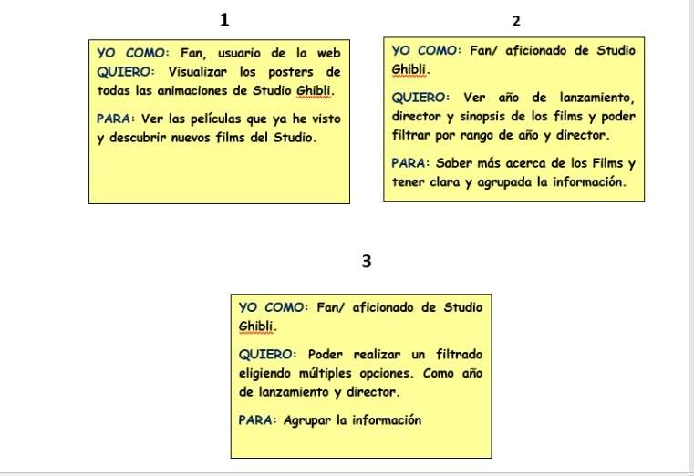
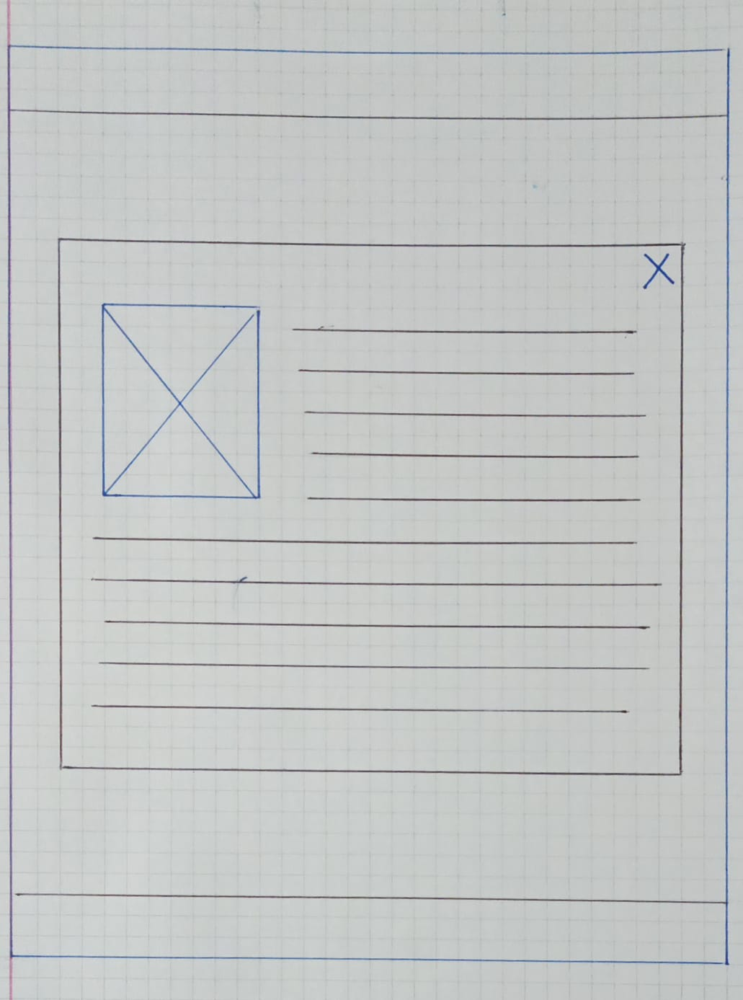
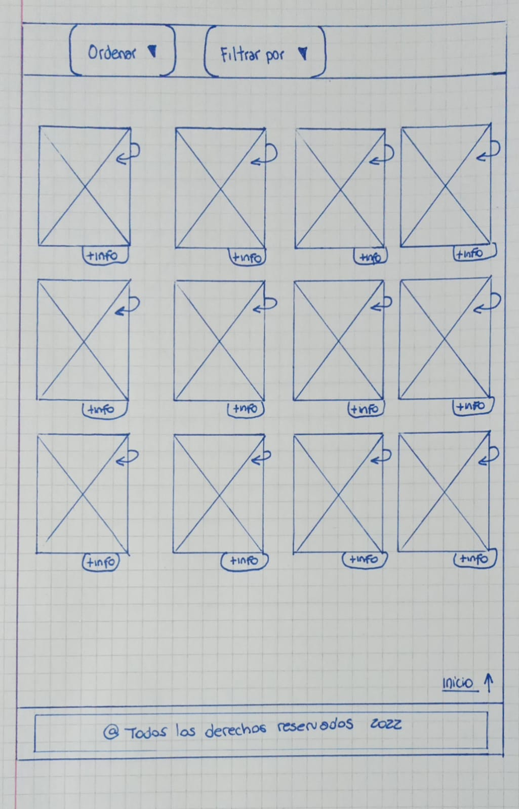
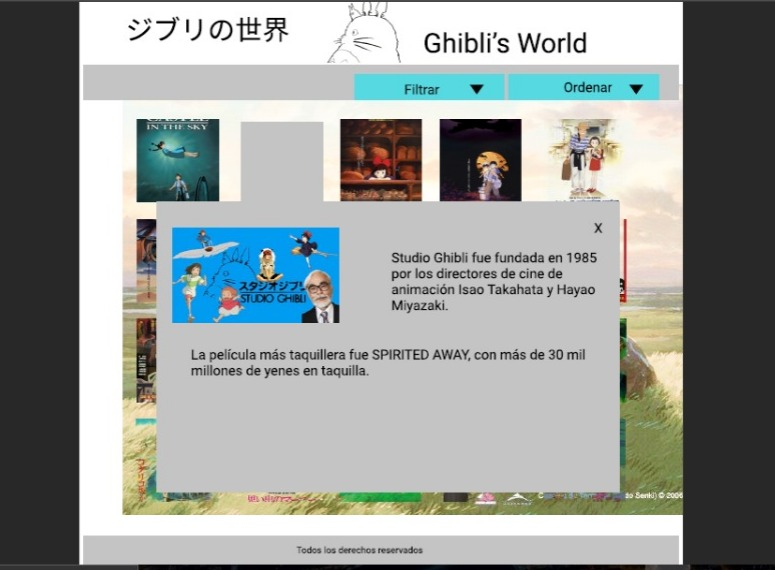
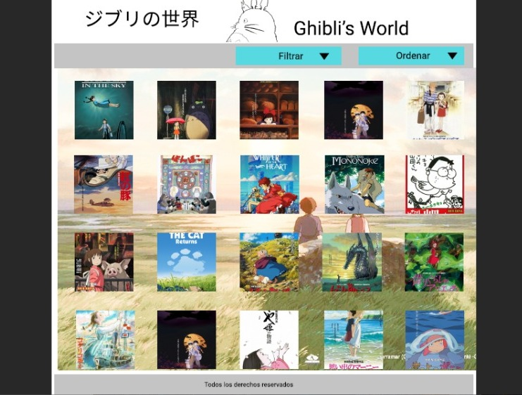

# Data Lovers - Ghibli´s World

## Índice

* [1. Definición del producto](#1-Definición-del-producto)
* [2. Historias de usuario](#2-Historias-de-usuario)
* [3. Prototipo de baja y alta fidelidad](#3-prototipo-de-baja-y-alta-fidelidad)
* [4. Test de usabilidad](#4-test-de-usabilidad)

***

## 1. Definición del producto

Ghibli´s World es una página web en donde el usuario puede interactuar, ordenando y filtrando la información más importante sobre los films del estudio de filmación japonesa Studio Ghibli. 

Pero . . . ¿Cómo definimos cuál es la información más importante? 

En base a nuestra investigación, descubrimos que un porcentaje de los entrevistados no tenía conocimiento alguno sobre el Studio Ghibli. Debido a ello, planteamos como alternativa, crear un modal capaz de resumir qué era Studio Ghibli, y qué podían esperar sobre sus animaciones. 

Por otra parte, de las personas que ya conocian los films, les pareció necesario tener la visualización de todos los films. Para complementar dicho requerimiento, de cada films, se mostró un poster y su título. 

Personalmente se creyó necesario visualizar la información de los films, como sinopsis, director, año de lanzamiento, de una manera dinámica. Fue así la ocurrencia de voltear los pósteres y observar dichos datos. 

¿Cúando el usuario utilizaría la página?
 
Se estima que la curiosidad del usuario se acrecenta en base a las recomendaciones y actividades que realice a lo largo del día. También en base a la propia experiencia del internauta. Puede entonces, después de una recomendación de su grupo de pares, una publicidad por televisión o al finalizar un película, que el usuario ingrese a la página a investigar sobre más films. 

## 2. Historias de usuario

Las historias de usuarios desarrolladas a través de 4 sprint fueron:

 1. Como usuario de la web o fan de Studio Ghibli quiero visualizar los pósters de todas las animaciones y ordenarlas alfabeticamente para saber cuales son.

 Definición de terminado: visualización de los 20 poster correspondiente a cada film. Boton con la opción de ordenar alfabeticamente.

 Criterios de aceptación:asegurarse que todos los films se visualicen sin repetirse. Asegurar el funcionamiento del boton ordenar y visualizar que los films estén ordenados por título alfabeticamente.

 2. Como usuario de la web o fan de Studio Ghibli quiero ver el año de lanzamiento, el director y la sinopsis de cada films y poder filtrar por rango de año y director para saber más sobre ellos y tener mayor claridad de la información.

 Definición de terminado: visualizar la información de cada films en formato tarjeta, apareciendo en el reverso del poster. Boton con la opción de filtrar por cada uno de los directores de Studio Ghibli o con la opción de rango de año.

 Criterios de aceptación: Asegurarse que al pasar el mouse por cada una de las tarjetas, se voltee de la forma correcta, no suporponiendose con los demás posteres. Observar la correcta información del reverso de las tarjetas. Asegurarse el funcionamiento de los botones de filtrado.

 3. Como usuario de la web o fan de Studio Ghibli quiero realizar un filtrado eligiendo múltiples opciones, como años de lanzamiento y director para agrupar la información. 

 Definición de terminado: visualización del checkbox para elegir el o los directores y/o los años para el filtrado múltiple. Funcionamiento del boton de ordenar luego de aplicar las filtraciones. 

 Criterios de aceptación: Asegurarse que tanto el filtrado como el ordenamiento sigan funcionando tanto de forma dependiente como independiente.

## 3. Prototipo de baja y alta fidelidad

 1- Prototipo Baja Fidelidad 

 

 

 2- Prototipo Alta Fidelidad 

 

 

## 4. Test de usabilidad

Los principales problemas que detectamos, fue al abrir la página mediante un dispositivo móvil. Debido a que no era tan intuitivo que el usuario haga clic en el poster para visualizar la información que contiene. 

La solución al principal problema detectado se enfoca en desarrollar una página web responsive y además amigable con el usuario.

